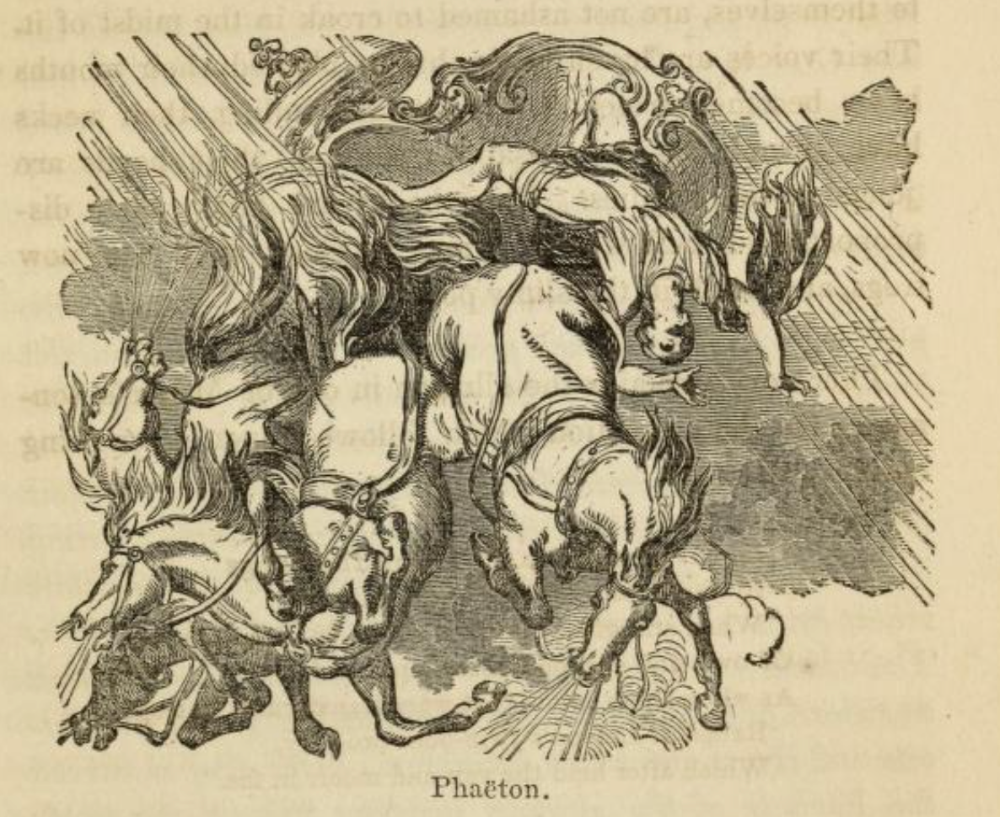

# Phaeton

I first heard this tale told in modern form, in the round, in a performace of [*Helios*](https://www.wrightandgrainger.com/helios), by  Wright and Granger, at Ventnor Exchange, in Spring 2024. When we picked the theme of "Elemental Tales" for our *'Tis Tales* show at Ventnor Fringe, 2024, it seemed like a good tale to tell in that context.

A version of the tale appears in narrative form in Bulfinch's *"Age of Fable, or, Stories of gods and heroes"* of 1855.

```{admonition} Pronunciation note
:class: warning
There are various spellings and accentuations of our lead character's name (Phaethon, Phaëthon, Phaeton, etc.) and examples of different forms of pronunciation of it. After chatting to several people (Elton Barker, Paul Cowdell) I think I have settled on Phi-(uh)-thon.
```

```{admonition} Phaeton, in Bullfinch's "Age of Fable", 1855
:class: dropdown

Thomas Bulfinch, "The age of fable, or, Stories of gods and heroes", 1855

pp59-68



PHAËTON.

Phaëton was the son of Apollo and the nymph Clymene. One day a schoolfellow laughed at the idea of his being the son of the god, and Phaeton went in rage and shame and reported it to his mother. "If," said he, "I am indeed of heavenly birth, give me, mother, some proof of it, and establish my claim to the honor." Clymene strtetched forth her hands towards the skies, and said, "I call to witness the Sun which looks down upon us, that I have told you the truth. If I speak falsely, let this be the last time I behold his light. But it needs not much labor to go and inquire for yourself; the land whence the Sun rises lies next to ours. Go and demand of him whether he will own you as a son." Phaeton heard with delight. He travelled to India, which lies directly in the regions of sunrise; and, full of hope and pride, approached the goal whence his parent begins his course.

The palace of the Sun stood reared aloft on columns, glittering with gold and precious stones, while polished ivory formed the ceilings, and silver the doors. The workmanship surpassed the material `[Materiem superabat opus. — Ovid.]`; for upon the walls Vulcan had represented earth, sea and skies, with their inhabitants. In the sea were the nymphs, some sporting in the waves, some riding on the backs of fishes, while others sat upon the rocks and dried their sea-green hair. Their faces were not all alike, nor yet unlike, — but such as sisters' ought to be. `[Facies non omnibus una, Nec diversa tamen, qualem decet esse sororum. — Ovid.]` The earth had its towns and forests and rivers and rustic divinities. Over all was carved the likeness of the glorious heaven; and on the silver doors the twelve signs of the zodiac, six on each side.

Clymene's son advanced up the steep ascent, and entered the halls of his disputed father. He approached the paternal presence, but stopped at a distance, for the light was more than he could bear. Phoebus, arrayed in a purple vesture, sat on a throne which glittered as with diamonds. On his right hand and his left stood the Day, the Month, and the Year, and, at regular intervals, the Hours. Spring stood with her head crowned with flowers, and Summer, with garment cast aside, and a garland formed of spears of ripened grain, and Autumn, with his feet stained with grape-juice, and icy Winter, with his hair stiffened with hoar frost. Surrounded by these attendants, the Sun, with the eye that sees every thing, beheld the youth dazzled with the novelty and splendor of the scene, and inquired the purpose of his errand. The youth replied, "O, light of the boundless world, Phoebus, my father, — if you permit me to use that name, — give me some proof, I beseech you, by which I may be known as yours." He ceased; and his father, laying aside the beams that shone all around his head, bade him approach, and embracing him, said, "My son, you deserve not to be disowned, and I confirm what your mother has told you. To put an end to your doubts, ask what you will, the gift shall be yours. I call to witness that dreadful lake, which I never saw, but which we gods swear by in our most solemn engagements." Phaëton immediately asked to be permitted for one day to drive the chariot of the sun. The father repented of his promise; thrice and four times he shook his radiant head in warning. "I have spoken rashly," said he; "this only request I would fain deny. I beg you to withdraw it. It is not a safe boon, nor one, my Phaëton, suited to your youth and strength. Your lot is mortal, and you ask what is beyond a mortal's power. In your ignorance you aspire to do that which not even the gods themselves may do. None but myself may drive the flaming car of day. Not even Jupiter, whose terrible right arm hurls the thunderbolts. The first part of the way is steep, and such as the horses when fresh in the morning can hardly climb; the middle is high up in the heavens, whence I myself can scarcely, without alarm, look down and behold the earth and sea stretched beneath me. The last part of the road descends rapidly, and requires most careful driving. Tethys, who is waiting to receive me, often trembles for me lest I should fall headlong. Add to all this, the heaven is all the time turning round and carrying the stars with it. I have to be perpetually on my guard lest that movement, which sweeps every thing else along, should hurry me also away. Suppose I should lend you the chariot, what would you do? Could you keep your course while the sphere was revolving under you? Perhaps you think that there are forests and cities, the abodes of gods, and palaces and temples on the way. On the contrary, the road is through the midst of frightful monsters. You pass by the horns of the Bull, in front of the Archer, and near the Lion's jaws, and where the Scorpion stretches its arms in one direction and the Crab in another. Nor will you find it easy to guide those horses, with their breasts full of fire that they breathe forth from their mouths and nostrils. I can scarcely govern them myself, when they are unruly and resist the reins. Beware, my son, lest I be the donor of a fatal gift; recall your request while yet you may. Do you ask me for a proof that you are sprung from my blood? I give you a proof in my fears for you. Look at my face, — I would that you could look into my breast, you would there see all a father's anxiety. Finally," he continued, "look round the world and choose whatever you will of what earth or sea contains most precious, — ask it and fear no refusal. This only I pray you not to urge. It is not honor, but destruction you seek. Why do you hang round my neck and still entreat me? You shall have it if you persist, — the oath is sworn and must be kept, — but I beg you to choose more wisely."

He ended; but the youth rejected all admonition, and held to his demand. So, having resisted as long as he could, Phoebus at last led the way to where stood the lofty chariot.

It was of gold, the gift of Vulcan; the axle was of gold, the pole and wheels of gold, the spokes of silver. Along the seat were rows of chrysolites and diamonds, which reflected all around the brightness of the sun. While the daring youth gazed in admiration, the early Dawn threw open the purple doors of the east, and showed the pathway strewn with roses. The stars withdrew, marshalled by the Daystar, which last of all retired also. The father, when he saw the earth beginning to glow, and the Moon preparing to retire, ordered the Hours to harness up the horses. They obeyed, and led forth from the lofty stalls the steeds full fed with ambrosia, and attached the reins. Then the father bathed the face of his son with a powerful unguent, and made him capable of enduring the brightness of the flame. He set the rays on his head, and, with a foreboding sigh, said, "If, my son, you will in this at least heed my advice, spare the whip and hold tight the reins. They go fast enough of their own accord; the labor is to hold them in. You are not to take the straight road directly between the five circles, but turn off to the left. Keep within the limit of the middle zone, and avoid the northern and the southern alike. You will see the marks of the wheels, and they will serve to guide you. And, that the skies and the earth may each receive their due share of heat, go not too high, or you will burn the heavenly dwellings, nor too low, or you will set the earth on fire; the middle course is safest and best `[Medio tutissimus ibis. — Ovid. "You will go most safely in the middle."]`. And now I leave you to your chance, which I hope will plan better for you than you have done for yourself. Night is passing out of the western gates and we can delay no longer. Take the reins; but if at last your heart fails you, and you will benefit by my advice, stay where you are in safety, and suffer me to light and warm the earth." The agile youth sprang into the chariot, stood erect and grasped the reins with delight, pouring out thanks to his reluctant parent.

Meanwhile the horses fill the air with their snortings and fiery breath, and stamp the ground impatient. Now the bars are let down, and the boundless plain of the universe lies open before them. They dart forward and cleave the opposing clouds, and outrun the morning breezes which started from the same eastern goal. The steeds soon perceived that the load they drew was lighter than usual; and as a ship without ballast is tossed hither and thither on the sea, so the chariot, without its accustomed weight, was dashed about as if empty. They rush headlong and leave the travelled road. He is alarmed, and knows not how to guide them; nor, if he knew, has he the power. Then, for the first time, the Great and Little Bear were scorched with heat, and would fain, if it were possible, have plunged into the water; and the Serpent which lies coiled up round the north pole, torpid and harmless, grew warm, and with warmth felt its rage revive. Bootes, they say, fled away, though encumbered with his plough, and all unused to rapid motion.

When hapless Phaeton looked down upon the earth, now spreading in vast extent beneath him, he grew pale and his knees shook with terror. In spite of the glare all around him, the sight of his eyes grew dim. He wished he had never touched his father's horses, never learned his parentage, never prevailed in his request. He is borne along like a vessel that flies before a tempest, when the pilot can do no more and betakes himself to his prayers. What shall he do? Much of the heavenly road is left behind, but more remains before. He turns his eyes from one direction to the other; now to the goal whence he began his course, now to the realms of sunset which he is not destined to reach. He loses his selfcommand, and knows not what to do, — whether to draw tight the reins or throw them loose; he forgets the names of the horses. He sees with terror the monstrous forms scattered over the surface of heaven. Here the Scorpion extended his two great arms, with his tail and crooked claws stretching over two signs of the zodiac. When the boy beheld him, reeking with poison and menacing with his fangs, his courage failed, and the reins fell from his hands. The horses, when they felt them loose on their backs, dashed headlong, and unrestrained went off into unknown regions of the sky, in among the stars, hurling the chariot over pathless places, now up in high heaven, now down almost to the earth. The moon saw with astonishment her brother's chariot running beneath her own. The clouds begin to smoke, and the mountain tops take fire; the fields are parched with heat, the plants wither, the trees with their leafy branches burn, the harvest is ablaze! But these are small things. Great cities perished, with their walls and towers; whole nations with their people were consumed to ashes! The forest-clad mountains burned, Athos and Taurus and Tmolus and CEte; Ida, once celebrated for fountains, but now all dry; the Muses' mountain Helicon, and Hremus; AEtna, with fires within and without, and Parnassus, with his two peaks, and Rhodope, forced at last to part with his snowy crown. Her cold climate was no protection to Scythia, Caucasus burned, and Ossa and Pindus, and, greater than both, Olympus; the Alps high in air, and the Apennines crowned with clouds.

Then Phaeton beheld the world on fire, and felt the heat intolerable. The air he breathed was like the air of a furnace and full of burning ashes, and the smoke was of a pitchy darkness. He dashed forward he knew not whither. Then, it is believed, the people of AEthiopia became black by the blood being forced so suddenly to the surface, and the Libyan desert was dried up to the condition in which it remains to this day. The Nymphs of the fountains, with dishevelled hair, mourned their waters, nor were the rivers safe beneath their banks; Tanais smoked, and Caicus, Xanthus and Meander. Babylonian Euphrates and Ganges, Tagus with golden sands, and Cayster where the swans resort. Nile fled away and hid his head in the desert, and there it still remains concealed. Where he used to discharge his waters through seven mouths into the sea, there seven dry channels alone remained. The earth cracked open, and through the chinks light broke into Tartarus, and frightened the king of shadows and his queen. The sea shrank up. Where before was water, it became a dry plain; and the mountains that lie beneath the waves lifted up their heads and became islands. The fishes sought the lowest depths, and the dolphins no longer ventured as usual to sport on the surface. Even Nereus, and his wife Doris, with the Nereids, their daughters, sought the deepest caves for refuge. Thrice Neptune essayed to raise his head above the surface, and thrice was driven back by the heat. Earth, surrounded as she was by waters, yet with head and shoulders bare, screening her face with her hand, looked up to heaven, and with a husky voice called on Jupiter.

"O, ruler of the gods, if I have deserved this treatment, and it is your will that I perish with fire, why withhold your thunderbolts? Let me at least fall by your hand. Is this the reward of my fertility, of my obedient service? Is it for this that I have supplied herbage for cattle, and fruits for men, and frankincense for your altars? But if I am unworthy of regard, what has my brother Ocean done to deserve such a fate? If neither of us can excite your pity, think, I pray you, of your own heaven, and behold how both the poles are smoking which sustain your palace, which must fall if they be destroyed. Atlas faints, and scarce holds up his burden. If sea, earth, and heaven perish, we fall into ancient Chaos. Save what yet remains to us from the devouring flame. O, take thought for our deliverance in this awful moment!"

Thus spoke Earth, and overcome with heat and thirst, could say no more. Then Jupiter omnipotent, calling to witness all the gods, including him who had lent the chariot, and showing them that all was lost unless some speedy remedy were applied, mounted the lofty tower from whence he diffuses clouds over the earth, and hurls the forked lightnings. But at that time not a cloud was to be found to interpose for a screen to earth, nor was a shower remaining unexhausted. He thundered, and brandishing a lightning bolt in his right hand launched it against the charioteer, and struck him at the same moment from his seat and from existence! Phaëton, with his hair on fire, fell headlong, like a shooting star which marks the heavens with its brightness as it falls, and Eridanus, the great river, received him and cooled his burning frame. The Italian Naiads reared a tomb for him, and inscribed these words upon the stone:—

"Driver of Phoebus' chariot, Phaëton,  
Struck by Jove's thunder, rests beneath this stone.  
He could not rule his father's car of fire,  
Yet was it much so nobly to aspire."

`[Hic situs est Phaeton, currus auriga paterni, Quem si non tenuit, magnis tamen excidit ausis. — Ovid. 'Here lies Phaeton, the driver of his father's chariot, which if he failed to manage, yet he fell in a great undertaking.']`

His sisters, the Heliades, as they lamented his fate, were turned into poplar trees, on the banks of the river, and their tears, which continued to flow, became amber as they dropped into the stream.

Milman, in his poem of Samor, makes the following allusion to Phaëton's story:—

"As when the palsied universe aghast  
Lay * * * * mute and still,  
When drove, so poets sing, the Sun-born youth  
Devious through Heaven's affrighted signs his sire's  
Ill-granted chariot. Him the Thunderer hurled  
From th' empyrean headlong to the gulf  
Of the half-parched Eridanus, where weep  
Even now the sister trees their amber tears  
O'er Phaëton untimely dead."

In the beautiful lines of Walter Savage Landor, descriptive of the Sea-shell, there is an allusion to the Sun's palace and chariot. The water-nymph says,—

"I have sinuous shells of pearly hue  
Within, and things that lustre have imbibed  
In the sun's palace porch, where when unyoked  
His chariot wheel stands midway in the wave.  
Shake one and it awakens; then apply  
Its polished lip to your attentive ear,  
And it remembers its august abodes,  
And murmurs as the ocean murmurs there."

*Gebir* , Book I.
```

Bulfinch's version is a reasonably close retelling of Ovid's *Metamorphoses*, introduced at the end of Book 1 and then continuing at the start of Book II.

The set-up derives from Phaeton boasting of his immortal parentage to Epaphus, in a tale that also tells of Epaphus' mother, Io's, encounter with his immortal father, Zeus (Jupiter).

```{admonition}
:class: dropdown
https://archive.org/details/bim_eighteenth-century_ovids-metamorphoses-in-_ovid_1717/page/n73/mode/1up?q=phaeton

Ovid's Metamorphoses in fifteen books. Translated by the most eminent hands. Adorn'd with sculptures.  1717
by Ovid

Publication date 1717

Book 1 p34-6

The Transformation of SYRINX into Reeds. (p31)

...

Her Son was Epaphus, at length believ'd  
The Son of ove, and as a God receiv'd;  
With Sacrifice adord, and publick Pray'rs,  
He common Temples with his Mother ſhares.  
Equal in Years and Rival in Renown  
With Epaphus, the youthful Phaeton  
Like Honour claims; and boaſts his Sire the Sun.  
His haughty Looks, and his aſſuming Air,  
The Son of Isis cou'd no longer bear:  
Thou tak'ſt thy Mother's word too far, ſaid he,  
And haſt uſurp'd thy boaſted Pedigree.  
Go, baſe Pretender to a borrow'd Name.  
Thus tax'd, he bluſh'd with Anger, and with Shame;  
But Shame repreſs'd his Rage: The daunted Youth  
Soon ſeeks his Mother, and enquires the truth:  
Mother, ſaid he, this Infamy was thrown  
By Epaphus on you, and me your Son.  
He ſpoke in publick, told it to my Face;  
Nor durſt I vindicate the dire Diſgrace:  
Even I, the bold, the ſenſible of Wrong,  
Reſtrain'd by Shame, was forc'd to hold my Tongue.  
To hear an open Slander, is a Curſe:  
But not to find an Anſwer, is a worſe.  
If I am Heav'n-begot, aſſert your Son  
By ſome ſure Sign; and make my Father known,  
To right my Honour, and redeem your own.  
He ſaid, and ſaying caſt his Arms about  
Her Neck, and begg'd her to reſolve the Doubt.

'Tis hard to judge if Clymene were mov'd  
More by his Pray'r, whom ſhe ſo dearly lov'd,  
Or more with Fury fird, to find her Name  
Traduc'd, and made the ſport of common Fame.  
She ſtretch'd her Arms to Heav'n, and fix'd her  
Eyes On that fair Planet, that adorns the Skies;  
Now by thoſe Beams, ſaid ſhe, whoſe holy Fires  
Conſume my Breaſt, and kindle my Deſires;  
By him, who ſees us both, and chears our ſight,  
By him the publick Miniſter of Light,  
I ſwear that Sun begot thee; if I lye,  
Let him his chearful Influence deny:  
Let him no more this perjur'd Creature ſee;  
And ſhine on all the World, but only me.  
If ſtill you doubt your Mother's Innocence,  
His Eaſtern Manſion is not far from hence;  
With little pains you to his Leve go,  
And from himſelf your Parentage may know.  
With joy th'ambitious Youth his Mother heard  
And eager, for the Journey ſoon prepar'd.  
He longs the World beneath him to ſurvey;  
To guide the Chariot; and to give the Day.  
From Meroe's burning Sands he bends his Courſe,  
Nor leſs in India feels his Father's force:  
His Travel urging, till he came in ſight;  
And ſaw the Palace by the Purple Light.

p37-49

METAMORPHOSES

BBOK II

Tranſlated by Mr. ADDIS ON.

The Story of PHAETON.

The Sun's bright Palace, on high Columns rais'd,  
With burniſh'd Gold and flaming Jewels blaz'd;  
The Folding-Gates diffus di a Silver Light,  
And with a milder Gleam refreſh'd the Sight;  
Of poliſh'd Iv'ry was the Cov'ring wrought:  
The Matter vied not with the Sculptor's Thought,  
For in the Portal was diſplay'd on high  
(The Work of Vulcan) a fictitious Sky;  
A waving Sea th' inferiour Earth embrac'd,  
And Gods and Goddeſſes the Waters grac'd.  
AEgeon here a mighty Whale beſtrode;  
Triton, and Proteus (the deceiving God)  
With Doris here were carv'd, and all her Train,  
Some looſely ſwimming in the figur'd Main,  
While ſome on Rocks their dropping Hair divide,  
And ſome on Fiſhes through the Waters glide:  
Tho' various Features did the Siſters grace,  
A Siſter's Likeneſs was in ev'ry Face.  
On Earth a diff'rent Landskip courts the Eyes,  
Men, Towns, and Beaſts in diſtant Proſpects riſe,  
And Nymphs, and Streams, and Woods, and rural Deities.  
O'er all, the Heav'ns refulgent Image ſhines;  
On either Gate were ſix engraven Signs.

Here Phaeton, ſtill gaining on th' Aſcent,  
To his ſuſpected Father's Palace went,  
Till preſſing forward through the bright Abode,  
He ſaw at Diſtance the illuſtrious God:  
He ſaw at Diſtance, or the dazling Light  
Had flaſh'd too ſtrongly on his aking Sight.

The God ſits high, exalted on a Throne  
Of blazing Gems, with Purple Garments on;  
The Hours, in order rang'd on either Hand,  
And Days, and Months, and Years, and Ages ſtand.  
Here Spring appears with flow'ry Chaplets bound;  
Here Summer in her wheaten Garland crown'd;  
Here Autumn the rich trodden Grapes beſmear;  
And hoary Winter ſhivers in the Reer.

Phebaus beheld the Youth from off his Throne;  
That Eye, which looks on All, was fix'd in One.  
He ſaw the Boy's Confuſion in his Face,  
Surpriz'd at all the Wonders of the Place;  
And cries aloud, "What wants my Son? for know  
"My Son thou art, and I muſt call thee fo.  
Light of the World, the trembling Youth replies,  
"Illuſtrious Parent! ſince you dont defpiſe  
The Parent's Name, ſome certain Token give,  
That I may Clymene's proud Boaſt believe,  
Nor longer under falſe Reproaches grieve.

The tender Sire was touch'd with what he ſaid,  
And flung the Blaze of Glories from his Head,  
And bid the Youth advance: "My Son, ſaid he,  
"Come to thy Father's Arms! for Clymene  
"Has told thee true; a Parent's Name I own,  
And deem thee worthy to be call'd my Son.  
"As a ſure Proof, make ſome Requeſt, and I,  
"Whate'er it be, with that Requeſt comply;  
"By Styx I ſwear, whoſe Waves are hid in Night,  
And roul impervious to My piercing Sight.

The Youth tranſported, asks, without Delay,  
To guide the Sun's bright Chariot for a Day.

The God repented of the Oath he took,  
For Anguiſh thrice his radiant Head he ſhook;  
"My Son, ſays he, ſome other Proof require,  
"Raſh was my Promiſe, raſh is thy Deſire.  
"I'd fain deny this Wiſh which thou haſt made,  
"Or, what I can't deny, wou'd tain diſſwade.  
"Too vaſt and hazardous the Task appears,  
"Nor ſuited to thy Strength, nor to thy Years.  
"Thy Lot is Mortal, but thy Wiſhes fly  
"Beyond the Province of Mortality:  
"There is not one of all the Gods that dares  
"(However skill'd in other great Affairs)  
"To mount the burning Axle-tree, but I;  
"Not Jove himſelf, the Ruler of the Sky,  
"That hurles the three-fork'd Thunder from above,  
"Dares try his Strength; yet who ſo ſtrong as Jove?  
"The Steeds climb up the firſt Aſcent with Pain,  
"And when the middle Firmament they gain,  
"If downward from the Heav'ns my Head I bow,  
"And ſee the Earth and Ocean hang below,  
"Ev'n I am ſeiz'd with Horror and Affright,  
"And my own Heart miſgives me at the Sight.  
"A mighty Downfal ſteeps the Ev'ning Stage,  
"And ſteddy Reins muſt curb the Horſes Rage.  
"Tethys her ſelf has fear'd to ſee me driv'n  
"Down headlong from the Precipice of Heav'n.  
"Beſides, conſider what impetuous Force  
"Turns Stars and Planets in a diff rent Courſe.  
"I ſteer againſt their Motions; nor am I  
"Born back by all the Current of the Sky.  
"But how cou'd you reſiſt the Orbs that roul  
"In adverſe Whirls, and ſtem the rapid Pole?  
"But you perhaps may hope for pleaſing Woods,  
"And ſtately Domes, and Cities fill'd with Gods;  
"While through a thouſand Snares your Progreſs lies,  
"Where Forms of ſtarry Monſters ſtock the Skies:  
"For, ſhou'd you hit the doubtful Way aright,  
"The Bull with ſtooping Horns ſtands Oppoſite;  
"Next him the bright Hæmonian Bow is ſtrung,  
"And next, the Lion's grinning Viſage hung:  
"The Scorpion's Claws here claſp a wide Extent,  
"And here the Crab's in leſſer Claſps are bent.  
"Nor wou'd you find it caſte to compoſe  
"The mettled Steeds, when from their Noſtrils lows  
"The ſcorching Fire, that in their Entrails glows.  
"Ey'n I their head-ſtrong Fury ſcarce reſtrain,  
"When they grow warm and reſtif to the Rein.  
"Let not my Son a fatal Gift require,  
"But, O! in time, recall your raſh Deſire;  
"You ask a Gift that may your Parent tell,  
"Let theſe my Fears your Parentage reveal;  
"And learn a Father from a Father's Care:  
"Look on my Face; or if my Heart lay bare,  
"Cou'd you but look, you'd read the Father there.  
"Chuſe out a Gift from Seas, or Earth, or Skies,  
"For open to your With all Nature lies,  
"Only decline this one unequal Task,  
"For tis a Miſchief, not a Gift you ask.  
"You ask a real Miſchief, Phaeton:  
"Nay hang not thus about my Neck, my Son:  
"I grant your Wiſh, and Styx has heard my Voice,  
"Chuſe what you will, but make a wiſer Choice.

Thus did the God th' unwary Youth adviſe;  
But he ſtill longs to travel through the Skies.  
When the fond Father (for in vain he pleads)  
AL length to the Vulcanian Chariot leads.  
A Golden Axle did the Work uphold,  
Gold was the Beam, the Wheels were orb'd with Gold.  
The Spokes in Rows of Silver pleas'd the Sight,  
The Seat with party-colourd Gems was bright;  
Apollo ſhin'd amid the Glare of Light.  
The Youth with ſecret Joy the Work ſurveys,  
When now the Morn diſclos'd her purple Rays;  
The Stars were fled, for Lucifer had chaſe't  
The Stars away, and fled himſelf at laſt.  
Soon as the Father ſaw the roſy Morn,  
And the Moon ſhining with a blunter Horn,  
He bid the nimble Hours, without Delay,  
Bring forth the Steeds; the nimble Hours obey:  
From their full Racks the gen'rous Steeds retire,  
Dropping ambroſial Foams, and ſnorting Fire.  
Still anxious for his Son, the God of Day,  
To make him Proof againſt the burning Ray,  
His Temples with Celeſtial Ointment wet,  
Of ſov'raign Virtue to repel the Heat;  
Then fix'd the beamy Cirele on his Head,  
And fetch'd a deep foreboding Sigh, and ſaid,

"Take this at leaſt; this laſt Advice, my Son,  
"Keep a ſtiff Rein, and move but gently on:  
"The Courſers of themſelves will run too faſt,  
"Your Art muſt be to Moderate their Haſte.  
"Drive em not on Directly through the Skies,  
"But where the Zodiac's Winding Circle lies,  
Along the midmoſt Zone; but ſally forth  
Nor to the diſtant South, nor ſtormy North.  
"The Horſes Hoofs a beaten Track will ſhow,  
"But neither mount too high, nor ſink too low.  
That no new Fires, or Heav'n, or Earth infeſt;  
"Keep the mid Way, the middle Way is beſt.  
"Nor, where in radiant Folds the Serpent twines,  
Direct your Courſe, nor where the Altar ſhines.  
"Shun both Extreams; the reſt let Fortune guide,  
"And better for thee than thy ſelf provide!  
"See, while I ſpeak, the Shades diſperſe away,  
"Aurora gives the Promiſe of a Day  
"I'm call'd, nor can I make a longer Stay.  
"Snatch up the Reins; or ſtill th' Attempt forſake,  
"And not my Chariot, but my Counſel take,  
"While yet ſecurely on the Earth you ſtand;  
"Nor touch the Horſes with too rafh a Hand.  
"Let Me alone to light the World, while You  
"Enjoy thoſe Beams which you may ſafely view.  
He ſpoke in vain; the Youth with active Heat  
And ſprightly Vigour vaults into the Seat  
And joys to hold the Reins, and fondly gives  
Thoſe Thanks his Father with Remorſe receives.

Mean while the reſtleſs Horſes neigh'd aloud,  
Breathing out Fire, and pawing where they ſtood.  
Tethys, not knowing what had paſt, gave way,  
And all the Waſte of Heav'n before em lay.  
They ſpring together out, and ſwiftly bear  
The flying Youth through Clouds and yielding Air;  
With wingy Speed outſtrip the Eaſtern Wind,  
And leave the Breezes of the Morn behind.  
The Youth was light, nor cou'd he fill the Seat,  
Or poiſe the Chariot with its wonted Weight:  
But as at Sea th' unballaſs'd Veſſel rides,  
Caſt to and fro, the Sport of Winds and Tides;  
So in the bounding Chariot toſs'd on high,  
The Youth is hurry'd headlong through the Sky.  
Soon as the Steeds perceive it, they forſake  
Their ſtated Courſe, and leave the beaten Track.  
The Youth was in a Maze, nor did he know  
Which way to turn the Reins, or where to go;  
Nor wou'd the Horſes, had he known, obey.  
Then the Sev'n Stars firſt felt Apollos Ray,  
And wiſh'd to dip in the forbidden Sea.  
The folded Serpent next the frozen Pole,  
Stiff and benum'd before, began to roll,  
And rag'd with inward Heat, and threaten'd War,  
And ſhot a redder Light from ev'ry Star;  
Nay, and tis ſaid Bootes too, that fain  
Thou wou'd'ſt have fled, tho' cumber'd with thy Wane.

Th' unhappy Youth then, bending down his Head,  
Saw Earth and Ocean far beneath him ſpread.  
His Colour chang'd, he ſtartled at the Sight,  
And his Eyes Darken'd by too great a Light.  
Now cou'd he wiſh the fiery Steeds untry'd,  
His Birth obſcure, and his Requeſt deny'd:  
Now wou'd he Merops for his Father own,  
And quit his boaſted Kindred to the Sun.

So fares the Pilot, when his Ship is toſt  
In troubled Seas, and All its Steerage loſt,  
He gives her to the Winds, and in Deſpair  
Seeks his laſt Refuge in the Gods and Pray'r.

What cou'd he do? his Eyes, if backward caſt,  
Find a long Path he had already paſt;  
If forward, till a longer Path they find:  
Both he compares, and meaſures in his Mind;  
And ſometimes caſts an Eye upon the Eaſt,  
And ſometimes looks on the forbidden Weſt.  
The Horſes Names he Knew not in the Fright,  
Nor wou'd he looſe the Reins, nor cou'd he hold 'em right.

Now all the Horrors of the Heav'ns he ſpies,  
And monſtrous Shadows of prodigious Size,  
That, deck'd with Stars, lye ſcatter'd o'er the Skies.  
There is a Place above, where Scorpio bent  
In Tail and Arms ſurrounds a vaſt Extent;  
In a wide Circuit of the Heav'ns he ſhines,  
And fills the Space of Two Coeleſtial Signs.  
Soon as the Youth beheld him, vex'd with Heat,  
Brandiſh his Sting, and in his Poiſon ſweat,  
Half dead with ſudden Fear he dropt the Reins;  
The Horſes felt em looſe upon their Mains,  
And, flying out through all the Plains above,  
Ran uncontroul'd where-e'er their Fury drove;  
Ruſh'd on the Stars, and through a pathleſs Way  
Of unknown Regions hurry'd on the Day.  
And now above, and now below they flew,  
And near the Earth the burning Chariot drew.

The Clouds diſperſe in Fumes, the wond'ring Moon  
Beholds her Brother's Steeds beneath her own;  
The Highlands ſmoak, cleft by the piercing Rays,  
Or, clad with Woods, in their own Fewel blaze.
Next o'er the Plains, where ripen'd Harveſts grow,  
The running Conflagration ſpreads Below.  
But theſe are trivial Ills: whole Cities burn,  
And peopled Kingdoms into Aſhes turn.

The Mountains kindle as the Car draws near,  
Athos and Tmolus red with Fires appear;  
Oeagrian Haemus (then a ſingle Name)  
And Virgin Helicon increaſe the Flame;  
Taurus and Octè glare amid the Sky,  
And Ida, ſpight of all her Fountains, Dry.  
Eryx, and Othrys, and Citheron, glow,  
And Rhodope, no longer cloath'd in Snow;  
High Pindus, Mimas, and Parnaſſus, ſweat,  
And AEna rages with redoubled Heat.  
Ev'n Scythia, through her hoary Regions warm'd,  
In vain with all her native Froſt was arm'd.  
Cover'd with Flames, the tow'ring Appennine,  
And Caucaſus, and proud Olympus, ſhine;  
And, where the long-extended Alpes aſpire,  
Now ſtands a huge continu'd Range of Fire.

Th' aſtoniſht Youth, where-e'er his Eyes cou's turn,  
Beheld the Univerſe around him burn:  
The World was in a Blaze; nor cou'd he bear  
The ſultry Vapours and the ſcorching Air,  
Which from below, as from a Furnace, flow'd;  
And now the Axle-tree beneath him glow'd:  
Loſt in the whirling Clouds, that round him broke,  
And white with Aſhes, hov'ring in the Smoke,  
He flew where-e'er the Horſes drove, nor knew  
Whither the Horſes drove, or where he flew.

'T'was then, they ſay, the ſwarthy Moor begun  
To change his Hue, and Blacken in the Sun.  
Then Libya firſt, of all her Moiſture drain'd,  
Became a barren Waſte, a Wild of Sand.  
The Water-Nymphs lament their empty Urns,  
Baeotia, robb'd of Silver Dirce, mourns,  
Corinth Pyrene's waſted Spring bewails,  
And Argos grieves whilſt Amymone fails.

The Floods are drain'd from ev'ry diſtant Coaſt,  
Ev'n Tanais, tho' fix'd in Ice, was loſt.  
Enrag'd Caicus and Lycormas roar,  
And Xanthas, fated to be burnt once more.  
The fam'd Mæander, that unweary'd ſtrays  
Through mazy Windings, ſmoaks in ev'ry Maze.  
From his lov'd Babylon Euphrates flies;  
The big-ſwoln Ganges and the Danube riſe  
In thick'ning Fumes, and darken half the Skies.  
In Flames Iſmenos andthe Phaſis roul'd,  
And Tagus floating in his melted Gold.  
The Swans, that on Cayſter often try'd  
Their tuneful Songs, now ſung their laſt and dy'd.  
The frighted Nile ran off, and under Ground  
Conceal'd his Head, nor can it yet be found:  
His ſev'n divided Currents all are dry,  
And here they roul d, ſev'n Gaping Trenches lye.  
No more the Rhine or Rhone their Courſe maintain,  
Nor Liber, of his promis'd Empire vain.

The Ground, deep-cleft, admits the dazling Ray,  
And ſtartles Plato with the Flaſh of Day.  
The Seas ſhrink in, and to the Sight diſcloſe
Wide naked Plains, where once their Billows roſe;  
Their Rocks are all diſcover'd, and increaſe
The Number of the ſcatter'd Cyclades.
The Fiſh in Sholes about the Bottom creep,  
Nor longer dares the crooked Dolphin leap:  
Gaſping for Breath, th unſhapen Phocae die,  
And on the boiling Wave extended lye.  
Nereus, and Doris with her Virgin Train,  
Seek out the laſt Receſſes of the Main;  
Beneath unfathomable Depths they faint,  
And ſecret in their gloomy Caverns pant.  
Stern Neptune thrice above the Waves upheld  
His Face, and thrice was by the Flames repell'd.

The Earth at length, on ev'ry Side embrac'd  
With ſcalding Seas, that floated round her Waſte,  
When now ſhe felt the Springs and Rivers come,  
And crowd within the Hollow of her Womb,  
Up-lifted to the Heav'ns her blaſted Head,  
And clapt her Hand upon her Brows, and ſaid;  
(But firſt, impatient of the ſultry Heat,  
Sunk deeper down, and ſought a cooler Seat:)  
"If you, great King of Gods, my Death approve,  
"And I deſerve it, let me die by Jove;  
"If I muſt periſh by the Force of Fire,  
"Let me transfix'd with Thunderbolts expire.  
"See, whilſt I ſpeak, my Breath the Vapours choak,  
(For now her Face lay wrapt in Clouds of Smoak)  
"See my ſinge'd Hair, behold my faded Eye,  
"And wither'd Face, where Heaps of Cinders lye!  
"And does the Plow for This my Body tear?  
"This the Reward for all the Fruits I bear,  
"Tortur'd with Rakes, and harraſs'd all the Year?  
"That Herbs for Cattle daily I renew,  
"And Food for Man, and Frankincenſe for You?  
"But grant Me guilty; what has Neptune done?  
"Why are his Waters boiling in the Sun?  
"The wavy Empire, which by Lot was givn,  
"Why does it waſte, and further ſhrink from Heav'n?  
"If I nor He your Pity can provoke,  
"See your own Heav'ns, the Heav'ns begin to ſmoke!  
"Shou'd once the Sparkles catch thoſe bright Abodes,  
"Deſtruction ſeizes on the Heay'ns and Gods;  
"Atlas becomes unequal to his Freight,  
"And almoſt faints beneath the glowing Weight.  
"If Heav'n, and Earth, and Sea, together burn,  
"All muſt again into their Chaos turn.  
"Apply ſome ſpeedy Cure, prevent our Fate,  
And ſuccour Nature, e'er it be too late.
She ceas'd, for choak'd with Vapours round her ſpread,  
Down to the deepeſt Shades ſhe ſunk her Head.

Jove call'd to witneſs ev'ry Pow'r above,  
And ev'n the God, whoſe Son the Chariot drove,  
That what he acts he is compell'd to do,  
Or univerſal Ruin muſt enſue.  
Strait he aſcends the high Ethereal Throne,  
From whence he us'd to dart his Thunder down,  
From whence his Show'rs and Storms he us'd to pour,  
But now cou'd meet with neither Storm nor Show'r.  
Then, aiming at the Youth, with lifted Hand,  
Full at his Head he hurl'd the forky Brand,  
In dreadful Thund'rings. Thus th' Almighty Sire  
Suppreſs'd the Raging of the Fires with Fire.

At once from Lite, and from the Chariot driv'n,  
Th' ambitious Boy fell Thunder-ſtruck from Heav'n.  
The Horſes ſtarted with a ſudden Bound,  
And flung the Reins and Chariot to the Ground:  
The ſtudded Harneſs from their Necks they broke,  
Here fell a Wheel, and here a Silver Spoke,  
Here were the Beam and Axle torn away;  
And, ſcatter'd o'er the Earth, the ſhining Fragments lay.  
The Breathleſs Phaeton, with flaming Hair,  
Shot from the Chariot, like a falling Star,  
That in a Summer's Ev'ning from the Top  
Of Heav'n drops down, or ſeems at leaſt to drop;  
Till on the Po his Blaſted Corps was hurl'd,  
Far from his Country, in the Weſtern World.  

p49-51

PHAETON'S *Sisters transfomr'd into Trees.*

The Latian Nymphs came round him, and amaz'd  
On the dead Youth, transfix'd with Thunder, gaz'd;
And, whilſt yet ſmoaking from the Bolt he lay,  
His ſhatter'd Body to a Tomb convey,  
And o'er the Tomb an Epitaph deviſe:  
"Here He who drove the Sun's bright Chariot lies;  
"His Father's fiery Steeds he cou'd not guide,  
"But in the glorious Enterprize he dy'd.

Apollo hid his Face, and pin'd for Grief,  
And, if the Story may deſerve Belief,  
The Space of One whole Day is ſaid to run,  
From Morn to wonted Ev'n, without a Sun:  
The burning Ruins, with a fainter Ray,  
Supply the Sun, and counterfeit a Day,  
A Day, that ſtill did Nature's Face diſcloſe:  
This Comfort from the mighty Miſchief roſe.

But Chment, enrag'd with Grief, laments,  
And as her Grief inſpires, her Paſſion vents:  
Wild for her Son, and frantick in her Woes,  
With Hair diſhevel'd, round the World ſhe goes,
To ſeek where-er his Body might be caſt;  
Till, on the Borders of the Po, at laſt  
The Name inſcrib'd on the new Tomb appears.  
The dear, dear Name she bathes in flowing Tears,  
Hangs o'er the Tomb, unable to depart,  
And hugs the Marble to her throbbing Heart.

Her Daughters too lament, and ſigh, and mourn,  
(A fruitleſs Tribute to their Brother's Urn)  
And beat their naked Boſoms, and complain,  
And call aloud for Phaeton in vain:  
All the long Night their mournful Watch they keep,  
And all the Day ſtand round the Tomb and weep.

Four times, revolving, the full Moon return'd;  
So long the Mother and the Daughters mourn'd:  
When now the Eldeſt, Phaethuſa, ſtrove  
To reſt her weary Limbs, but cou'd not move;  
Lampetia wou'd have help'd her, but ſhe found  
Her ſelf with-held, and rooted to the Ground:  
A Third in wild Affliction, as ſhe grieves,  
Wou'd rend her Hair, but fills her Hand with Leaves;  
One ſees her Thighs transform'd, Another views  
Her Arms ſhot out, and branching into Boughs.  
And now their Legs, and Breaſts, and Bodies ſtood  
Cruſted with Bark, and hard'ning into Wood;  
But ſtill Above were Female Heads diſplay'd,  
And Mouths, that call'd the Mother to their Aid.  
What cou'd, alas! the weeping Mother do?  
From this to that with eager Haſte ſhe flew,  
And kifs'd her Sprouting Daughters as they grew.  
She tears the Bark that to each Body cleaves,  
And from their verdant Fingers ſtrips the Leaves:  
The Blood came trickling, where ſhe tore away  
The Leaves and Bark: The Maids were heard to ſay,  
"Forbear, miſtaken Parent, Oh! forbear;  
"A wounded Daughter in each Tree you tear;  
"Farewell for ever." Here the Bark encreas'd,  
Clos'd on their Faces, and their Words ſuppreſs'd.

The new-made Trees in Tears of Amber run,  
Whhich, harden'd into Value by the Sun,  
Diſtill for ever on the Streams below:  
The limpid Streams their radiant Treaſure ſhow,  
Mixt in the Sand; whence the rich Drops convey'd  
Shine in the Dreſs of the bright Latian Maid.

p51-2

The Transformation of CYGNUS into a Swan.

Cycus beheld the Nymphs transform'd, ally'd  
To their dead Brother, on the Mortal Side,  
In Friendſhip and Affection nearer bound;  
He leſt the Cities and the Realms he own'd,  
Thro' pathleſs Fields and lonely Shores to range,  
And Woods, made Thicker by the Siſters Change:  
Whilſt here, within the diſmal Gloom, alone,  
The melancholy Monarch made his Moan,  
His Voice was leſſen'd, as he try'd to ſpeak,  
And iſſu'd through a long extended Neck;  
His Hair transforms to Down, his Fingers meet  
In skinny Films, and ſhape his oary Feet;  
From both his Sides the Wings and Feathers break;  
And from his Mouth proceeds a blunted Beak:  
All Cycnus now into a Swan was turn'd,  
Who, ſtill remembring how his Kinſman burn'd,  
To ſolitary Pools and Lakes retires,  
And loves the Waters as oppos'd to Fires.

Mean-while Apollo in a gloomy Shade  
(The native Luſtre of his Brows decay'd)  
Indulging Sorrow, ſickens at the Sight  
Of his own Sun-ſhine, and abhors the Light:  
The hidden Griefs, that in his Boſom riſe,  
Sadden his Looks, and over-caſt his Eyes,
As when ſome dusky Orb obſtructs his Ray,  
And ſullies, in a Dim Eclipſe, the Day.

Now ſecretly with inward Griefs he pin'd,  
Now warm Reſentments to his Griefs he joyn'd,  
And now renounc'd his Office to Mankind.  
"Ei'r ſince the Birth of Time, ſaid he, I've born  
"A long ungrateful Toil without Return;  
"Let now ſome Other manage, if he dare,  
"The fiery Steeds, and mount the burning Carr;  
"Or, if none elſe, let Jove his Fortune try,  
"And learn to lay his murd'ring Thunder by;  
"Then will he own, perhaps, but own too late,  
"My Son deſery'd not ſo ſevere a Fate.

The Gods ſtand round him, as he mourns, and pray  
He would reſume the Conduct of the Day,  
Nor let the World be loſt in endleſs Night:  
Jove too himſelf, deſcending from his Height,  
Excuſes what had happen'd, and intreats,  
Majeſtically mixing Pray'rs and Threats.  
Prevail'd upon at length, again he took  
The harneſs'd Steeds, that ſtill with Horror ſhook,  
And plies em with the Laſh, and whips em on,  
And, as he whips, upbraids em with his Son.
```

In Nonnus' *Dionysiaca*, we get additional colour regarding the birth of CLymene, Phaethon's mother, as well as his childhood games:

```{admonition} In "Dionysiaca", Nonnus, transl. W. H. Rouse, 1940
:class: dropdown
https://archive.org/details/dionysiaca03nonnuoft/page/98/mode/2up?q=phaeton
Dionysiaca
by Nonnus, of Panopolis; Frye, Northrop. Marginalia; Rouse, W. H. D. (William Henry Denham), 1863-1950; Rose, H. J. (Herbert Jennings), 1883-1961; Lind, L. R. (Levi Robert), 1906-

Publication date 1940

Vol 3

Book XXXVIII

p99-123

L96-434

[96] At these words, Dionysos rejoiced in hope of victory; then he questioned Hermes and wished to hear more of the Olympian tale which the Celts of the west know well: how Phaethon tumbled over and over through the air, and why even the daughters of Helios were changed into trees beside the moaning Eridanos, and from their leafy trees drop sparkling tears into the stream.

[103] In answer, friendly Hermes opened his mouth and noised out his inspired tale to Bacchos eagerly listening:

[105] "Dionysos, joy of mankind, shepherd of human life! If sweet desire constrains you to hear these ancient stories, I will tell you the whole tale of Phaethon from beginning to end. `[For the literary history of Phaethon from Alexandrian times on, see G. Knaack, [Quaestions Phaëthonteae, Berlin 1886.]`

[108] "Loudbooming Oceanos, girdled with the circle of the sky, who leads his water earth-encompassing round the turning point which he bathes, was joined in primeval wedlock with Tethys. The watery bridegroom begat Clymene, fairest of the Naiads, whom Tethys nursed on her wet breast, her youngest, a maiden with lovely arms. For her beauty Helios pined, Helios who spins round the twelvemonth lichtgang `[TH: German, light corridor]`, and travels the sevenzone circuit `[The Zodiac (because all the planets move within it). The Greeks called the seven heavenly bodies planets; these were the real planets, Mercury, Venus, Mars, Jupiter, Saturn, and also the sun and moon. Thus the Zodiac is called sevenzoned. Note that they did not regard the Earth as a planet, and did not know the planets Uranus and Neptune (+ Pluto)]` garland-wise — Helios dispenser of fire was afflicted with another fire! The torch of love was stronger than the blaze of his car and the shining of his rays, when over the bend of the reddened Ocean as he bathed his fiery form in the eastern waters, he beheld the maiden close by the way, while she swam naked and sported in her father's waves. Her body gleamed in her bath, she was one like the full Moon reflected in the evening waters, when she has filled the compass of her twin horns with light. Half-seen, unshod, the girl stood in the waves shooting the rosy shafts from her cheeks at Helios; her shape was outlined in the waters, no stomacher hid her maiden bosom, but the glowing circle of her round silvery breasts illuminated the stream.

[130] " Her father united the girl to the heavenly charioteer. The lightfoot Seasons acclaimed Clymene's bridal with Helios Lightbringer, the Naiad Nymphs danced around; in a watery bridal-bower the fruitful maiden was wedded in a flaming union, and received the hot bridegroom into her cool arms. The light that shone on that bridal bed came from the starry train; and the star of Cypris, Lucifer, herald of the union, wove a bridal song. Instead of the wedding torch, Selene sent her beams to attend the wedding. The Hesperides raised the joy-cry, and Oceanos beside his bride Tethys sounded his song with all the fountains of his throat.

[142] "Then Clymene's womb swelled in that fruitful union, and when the birth ripened she brought forth a baby son divine and brilhant with light. At the boy's birth his father's ether saluted him with song; as he sprang from the childbed, the daughters of Oceanos cleansed him, Clymene's son, in his grandsire's waters, and wrapt him in swaddlings. The stars in shining movement leapt into the stream of Oceanos which they knew so well, and surrounded the boy, with Selene our Lady of Labour, sending forth her sparkling gleams. Helios gave his son his own name, as well suited the testimony of his form; for upon the boy's shining face was visible the father's inborn radiance.

[155] "Often in the course of the boy's training Oceanos would have a pretty game, lifting Phaethon on his midbelly and letting him drop down; he would throw the boy high in the air, rolling over and over moving in a high path as quick as the wandering wind, and catch him again on his arm; then he would shoot him up again, and the boy would avoid the ready hand of Oceanos, and turn a somersault round and round till he splashed into the dark waters, prophet of his own death. The old man groaned when he saw it, recognizing the divine oracle, and hid all in prudent silence, that he might not tear the happy heart of Clymene the loving mother by foretelling the cruel threads of Phaethon's Fate.

[167] "So the boy, hardly grown up, and still with no down on his lip, sometimes frequented his mother Clymene's house, sometimes travelled even to the meadows of Thrinacia, `[The island (later identified with Sidly) where the cattle of the Sun were, see Od, xii. 127; Lampetië was in charge of them.]` where he would often visit and stay with Lampetië, tending cattle and sheep ... There he would long for his father the charioteer divine; made a wooden axle with skilful joinery, fitted on a sort of round wheel for his imitation car, fashioned yoke-straps, took three light withies from the flowering garden and plaited them into a lash, put unheard-of bridles on four young rams. Then he made a clever imitation of the morning star round like a wheel, out of a bunch of white flowers, and fixed it in front of his spokewheeled waggon to show the shape of the star Lucifer. He set burning torches standing about his hair on every side, and mimicked his father with fictitious rays as he drove round and round the coast of the seagirt isle.

[184] "But when he grew up into the fair bloom of youth, he often touched his father's fire, lifted with his little hand the hot yokestraps and the starry whip, busied himself with the wheel, stroked the horses' coats with snow-white hands — and so the playful boy enjoyed himself. With his right hand he touched the fireshotten bridle, mad with longing to manage the horses. Seated on his father's knees, he shed imploring tears, and begged for a run with the fiery chariot and heavenly horses. His father said no, but he only begged and prayed all the more with gracious pleading. Then the father said in affectionate words to his young son in the highfaring car:

[196] "'Dear son of Helios, dear grandson of Oceanos, ask me another boon; what have you to do with the chariot of the sky? Let alone the course of horsemanship. You cannot attain it, for you cannot guide my car — I can hardly drive it myself! Furious Ares never armed him with flaming thunderbolt, but he blares his tune with a trumpet, not with thunder. Hephaistos never collects his father's clouds; he is not called Cloudgatherer like Cronion, but hammers his iron anvil in the forge, and pours artificial blasts of artificial wind. Apollo has a winged swan, not a running horse. Hermes keeps his rod and wears not his father's aegis, lifts not his father's fiery lightning. But you will say — "He gave Zagreus the flash of the thunderbolt." Yes, Zagreus held the thunderbolt, and came to his death! Take good care, my child, that you too suffer not woes like his.'

[212] "'So he spoke, but the boy would not listen; he prodded his father and wetted his tunic with hotter tears. He put out his hands and touched his father's fiery beard; kneeling on the ground he bent his arched neck, pleading, and when the father saw, he pitied the boy. Clymene cried and begged too. Then although he knew in his heart the immovable inflexible spinnings of Fate, he consented regretful, and wiped with his tunic the rain of tears from the unsmiling face of sad Phaethon, and kissed the boy's lips while he said:

[222] "'There are twelve houses in all the fiery ether, set in the circle of the rounded Zodiac, one close after another in a row, each separate; through these alone is the inclined winding path of the restless planets rolling in their courses. All round these Cronos crawls from house to house on his heavy knees along the seventh zone upon the circle, until at last with difficulty he completes thirty circuits of returning Selene. `[i.e. Saturn takes two and a half years to traverse one sign (30°), and therefore thirty years for the whole Zodiac.]` On the sixth, quicker than his father, Zeus has his course opposite, and goes his round in a lichtgang. By the third, fiery Ares passes [one sign that is, of the Zodiac `[A line to this effect has perhaps been lost. The counting is very odd: Saturn is "seventh," i.e. from the earth, but Ares "third," i.e. counting from Saturn.]`] in sixty days, near your father. I myself rise in the fourth, and traverse the whole sky garland-wise in my car, following the winding circles of the heavenly orbits. I carry the measures of time, surrounded by the four Seasons, about the same centre, until I have passed through a whole house and fulfilled one complete month as usual; I never leave my journey unfinished and change to a backward course, nor do I go forward again; since the other stars, the planets, in their various courses always run contrary ways: they check backwards, and go both to and fro; when the measures of their way are half done they run back again, thus receiving on both sides my one-sided light. `[The sun (regarded by the Greeks as a planet) never retrogresses, as the other planets appear to do. As half the other planets (Including the moon) are above and half below him (on the geocentric theory), each of them gets his light from one side only.]` One of these planets is the horned moon whitening the sky; when she has completed all her circuit, she brings forth with her wise fire the month, being at first half seen, then curved, `[The curving outline between first quarter and full moon (Stegemann).]` then full moon with her whole face. Against the moon I move my rolling ball, the sparkling nourisher of sheafproducing growth, and pass on my endless circuit about the turning-point of the Zodiac, creating the measures of time. When I have completed one whole circle passing from house to house I bring off the lichtgang. Take care of the crossing-point itself, `[Where the moon cuts the ecliptic. The cone is the conical shadow of the earth, but this of course is on the side away from the sun. Nonnos is hopelessly confused.]` lest when you come close, rounding the cone of darkness with your car, it should steal all the light from your overshadowed chariot. And in your driving do not stray from the usual circuit of the course, or be tempted to leave your father's usual goal by looking at the five parallel circles `[The arctic, the two tropic, the equatorial and the antarctic circles. He must keep between the tropics, imaginary parallel circles drawn through the two solstitial points in Cancer and Capricorn, as these bound the Zodiac.]` with their multiple bond of long encompassing lines, or your horses may run away and carry you through the air out of your course. Do not, when you look about on the twelve circles `[An absurd inaccuracy for the 12 signs.]` as you cross them, hurry from house to house. When you are driving your car in the Ram, do not try to drive over the Bull. Do not seek for his neighbour, the Scorpion moving among the stars, the harbinger of the plowtree, `[The beginning of autumn ploughing.]` when you are driving under the Balance, until you complete the thirty degrees. `[The distance from the beginning of one sign to the beginning of the next is 30 degrees. What follows describes the Sun's yearly course through the Signs.]`

[267] "'Just listen to me, and I will tell you everything. When I reach the Ram, the centre `[More absurdity; Aries is the starting-point on the circle of the Zodiac, not the centre of anything.]` of the universe, the navel-star of Olympos, I in my exaltation let the Spring increase; and crossing the herald of the west wind, the turning-line which balances night equal with day, I guide the dewy course of that Season when the swallow comes. Passing into the lower house, opposite the Ram, I cast the light of equal day on the two hooves; and again I make day balanced equally with dark on my homeward course when I bring in the leafshaking course of the autumn Season, and drive with lesser light to the lower turningpoint in the leafshedding month. Then I bring winter for mankind with its rains, over the back of fishtailed Capricorn, that earth may bring forth her gifts full of life for the farmers, when she receives the bridal showers and the creative dew. I deck out also corntending summer the messenger of harvest, flogging the wheatbearing earth with hotter beams, while I drive at the highest point of my course `[The summer solstice.]` in the Crab, who is right opposite to the cold Capricorn: both Nile and grapes together I make to grow.

[287] "'When you begin your course, pass close by the side of Cerne, `[Cf. xvi. 45.]` and take Lucifer as guide to lead the way for your car, and you will not go astray; twelve circhng Hours `[The Sun has twelve minor hours attendant upon him, which are elsewhere assigned to the months, here clearly to the hours of the day.]` in turn will direct your way.'

[291] After this speech, he placed the golden helmet on Phaethon's head and crowned him with his own fire, winding the seven rays like strings upon his hair, and put the white kilt girdlewise round him over his loins; he clothed him in his own fiery robe and laced his foot into the purple boot, and gave his chariot to his son. The Seasons brought the fiery horses of Helios from their eastern manger; Lucifer came boldly to the yoke, and fastened the horses' necks in the bright yokestraps for their service.

[301] "Then Phaëthon mounted, Helios his father gave him the reins to manage, shining reins and gleaming whip: he shook in trembhng silence, for he understood that his son had not long to live. Clymene his mother could be half seen near the shore, `[i.e. she was up to her waist in water.]` as she watched her dear son mounting the flaming car, and shook with joy.

[307] "Already Lucifer was sparkling, that dewy star, and Phaethon rose traversing the eastern ambit, after his bath in the waters of Oceanos his grandsire. The bold driver of brilliant horses, running on high, scanned the heavens dotted with the company of the stars, girdled about by the seven Zones; he beheld the planets moving opposite, he saw the earth fixed in the middle like a centre, uplifted on tall cliffs and fortified on all sides by the winds in her caverns, he scanned the rivers, and the brows of Oceanos, driving back his own water into his own stream.

[318] "While he directed his eye to the upper air and the flood of stars, the diverse races of earth and the restless back of the sea, gazing round and round on the foundations of the infinite universe, the shining horses rolled along under the yoke over their usual course through the zodiac. Now inexperienced Phaëthon with his fiery whip could be seen flogging the horses' necks; they went wild shrinking under the goad of their merciless charioteer, and all unwilling they ran away over the limit of their ancient road beyond the mark of the zodiac, expecting a different call from their familiar driver. Then there was tumult along the bounds of the South and the back of the North Wind; the quickfoot Seasons at the celestial gate wondered at the strange and unreal day, Dawn trembled, and star Lucifer cried out.

[333] "'Where are you hurrying, dear boy? Why have you gone mad with reins in your hand? Spare your headstrong lash! Beware of these two companies— both planets and company of fixed stars, lest bold Orion kill you with his knife, lest ancient Boötes hit you with fiery cudgel. Spare this wild driving, and let not the Olympian Whale entomb you in his belly in high heaven; let not the Lion tear you to pieces, or the Olympian Bull arch his neck and strike you with fiery horn! Respect the Archer, or he may kill you with a firebarbed arrow from his drawn bowstring. Let there not be a second chaos, and the stars of heaven appear at the rising day, or erratic Dawn meet Selene at noonday in her car!'

[347] "As he spoke, Phaethon drove harder still, drawing his car aside to South, to North, close to the West, near to the East. There was tumult in the sky shaking the joints of the immovable universe: the very axle bent which runs through the middle of the revolving heavens. Libyan Atlas could hardly support the selfrolling firmament of stars, as he rested on his knees with bowed back under this greater burden. Now the Serpent scraped with his writhing belly the equator far away from the Bear, and hissed as he met with the starry Bull; the Lion roared out of his throat against the scorching Dog, heating the air with ravening fire, and stood boldly to attack the eight claws of the Crab with his shaggy hair bristling, while the heavenly Lion's thirsty tail flogged the Virgin hard by his hind leg, `[Leo lashed his tail so hard that it hit the next constellation, Virgo!]` and the winged Maiden darting past the Waggoner came near the pole and met the Wain. The Morning Star sent forth his straying light in the setting region of the West and pushed away the Evening Star who met him there. Dawn wandered about; blazing Sirius grabbed the thirsty Bear `["Thirsty," because it nerer sets and ao water.]` instead of his usual Hare. The two starry Fishes left one the South and one the North, and leapt in Olympos near Aquarius; the Dolphin danced in a ring and tumbled about with Capricorn. Scorpios also had wandered around from the southern path until he came near to Orion and touched his sword — Orion trembled even among the stars, lest he might creep up slowly and pierce his feet once again with a sharp sting. `[When he was on earth, Orion was killed by the sting of a huge scorpion, and the two constellations commemorate this.]` The Moon leapt up at midday, spitting off the half-completed light from her face and growing black on the surface, for she could no longer steal the counterfeit light from the male torch of Phaëthon opposite and milk out his inborn flame. The sevenstar voices of the Pleiades rang circling round the sevenzone sky with echoing sound; the planets from as many `[Presumably six; one planet, the Sun, was otherwise engaged. There are six Pleiades, omitting the one (Electra) which is too dim to see clearly.]` throats raised an outcry and rushed wildly against them. Cypris pushed Zeus, Ares Cronos `[Venus, Jupiter, Mars, Saturn.]`; my own wandering star `[The planet Mercury.]` approached the Pleiad of Spring, and mingling a kindred light with the seven stars he rose halfseen beside my mother Maia — he turned away from the heavenly chariot, beside which he always runs or before it in the morning, and in the evening when Helios sets he sends his following light, and because he keeps equal course with him and travels with equal portion, astronomers have named him the Sun's Heart. Europa's bridegroom the Olympian Bull bellowed, stretching his neck drenched with damp snowflakes; he raised a foot curved for a run, and inclining his head sideways with its sharp horn against Phaëthon, stamped on the heavenly vault with fiery hooves. Bold Orion drew sword from sheath hanging by his glowing thigh; Boötes shook his cudgel; Pegasos neighed rearing and shaking the knees of his starry legs — halfseen `[The figure of the constellation shows only the front half of the heavenly horse, here called Pegasos.]` the Libyan courser trod the firmament with his foot and galloped towards the Swan his neighbour, angrily flapping his wings, that again he might send another rider hurtling down from the sky as he had once thrown Bellerophontes himself out of the heavenly vault. `[When he tried to ride to heaven on Pegasos's back.]` No longer the circling Bears danced back to back beside the northern turningpost on high; but they passed to the south, and bathed their unwashen feet in the unfamiliar Ocean beside the western main.

[410] "Then Father Zeus struck down Phaëthon with a thunderbolt, and sent him rolling helplessly from on high into the stream of Eridanos. He fixed again the joints which held all together with their primeval union, gave back the horses to Helios, brought the heavenly chariot to the place of rising; and the agile Hours that attended upon Phaëthon followed their ancient course. All the earth laughed again. Rain from lifebreeding Zeus cleared all the fields, and with moist showers quenched the wandering fires, all that the glowing horses had spat whinnying from their flaming throats out of the sky over all the earth. Helios rose driving his car on his road again; the crops grew, the orchards laughed again, receiving as of yore the life-giving warmth from the sky.

[424] "But Father Zeus fixed Phaëthon in Olympos, like a Charioteer, and bearing that name. As he holds in the radiant Chariot of the heavens with shining arm, he has the shape of a Charioteer starting upon his course, as if even among the stars he longed again for his father's car. The fire-scorched river also came up to the vault of the stars with consent of Zeus, and in the starry circle rolls the meandering stream of burning Eridanos `[The Milky Way.]`.

[432] "But the sisters of the charioteer fallen to his early death changed their shape into trees, and from the weeping trees they distil precious dew `[Amber.]` out of their leaves."
```
